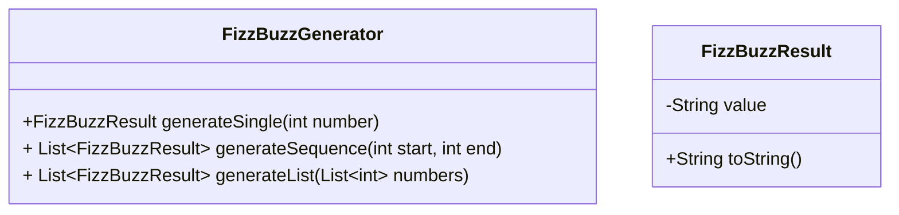
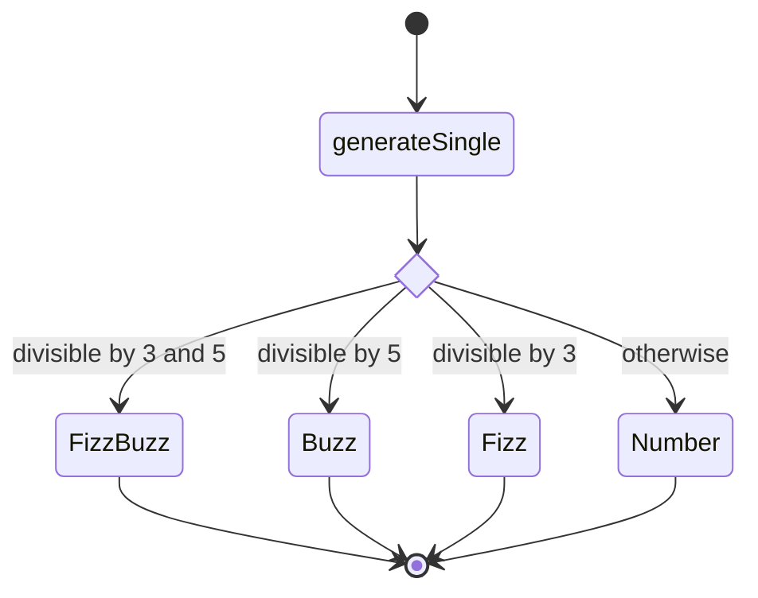

# FizzBuzz Enterprise

## A solution from nerds for nerds

```mermaid
classDiagram
    class FizzBuzzGenerator {
        +FizzBuzzResult generateSingle(int number)
        + List~FizzBuzzResult~ generateSequence(int start, int end)
        + List~FizzBuzzResult~ generateList(List~int~ numbers)
    }

    class FizzBuzzResult {
        -String value
        +String toString()
    }


```

Some text in between

```mermaid
stateDiagram
    [*] --> generateSingle
    state fizzBuzzChoice <<choice>>
    generateSingle --> fizzBuzzChoice
    fizzBuzzChoice --> FizzBuzz: divisible by 3 and 5
    fizzBuzzChoice --> Fizz: divisible by 3
    fizzBuzzChoice --> Buzz : divisible by 5
    fizzBuzzChoice --> Number: otherwise
    FizzBuzz --> [*]
    Buzz --> [*]
    Fizz --> [*]
    Number --> [*]
```
